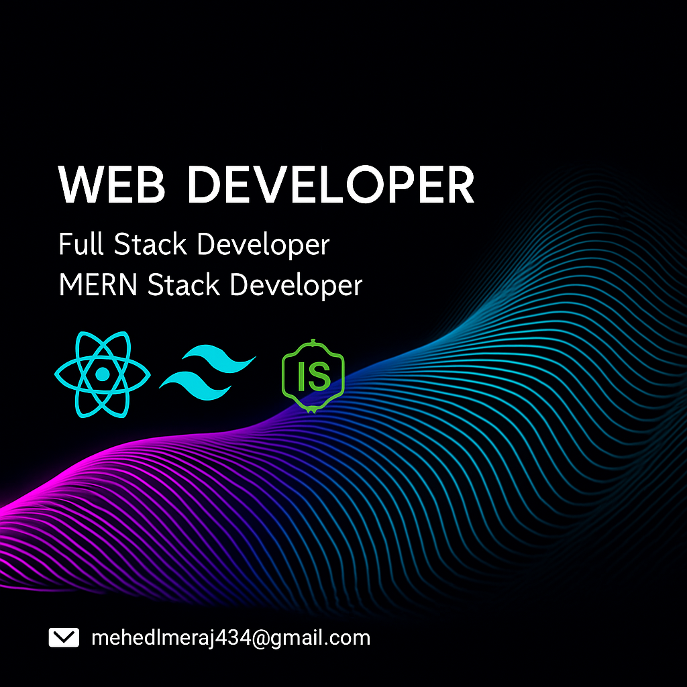

  

..................................................................................................................................................................................................................................

✅## Current Status

<!-- GitHub Streak Stats -->
 

<!-- Top Languages -->

---

<!-- Reach Me Out -->
<h2 >🔗 Reach Me Out</h2>

  
  
 

---

<!-- Technologies -->
<h2>💻 Technologies that I know</h2>

  <!-- Frontend -->
  
  
  
  
  
  
   
  
  
  
   
  
  

---

<!-- Current Overview -->
<h2 align="left">👀 Current Overview</h2>
🔧 Currently focusing on:
- Building full-stack web applications using **MongoDB, Express, React, and Node.js**
- Designing clean UI with **Tailwind CSS**
- Writing clean, maintainable, and scalable code
- Gaining hands-on experience through **real-world projects**

📫 Feel free to explore my repositories and connect with me!
- 💼 I'm currently **seeking internships or junior developer roles** to grow my skills and contribute to real-world projects.  
- 🤝 I'm open to **collaborating on meaningful open-source projects** to gain hands-on experience and build connections.  
- 🚀 I'm passionate about **helping others learn web development** by sharing what I learn along the way.

---

